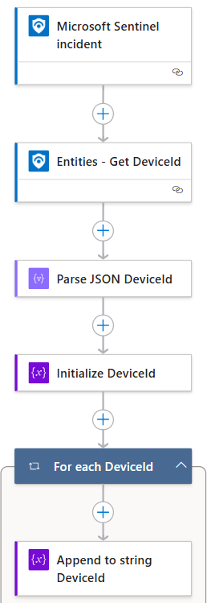
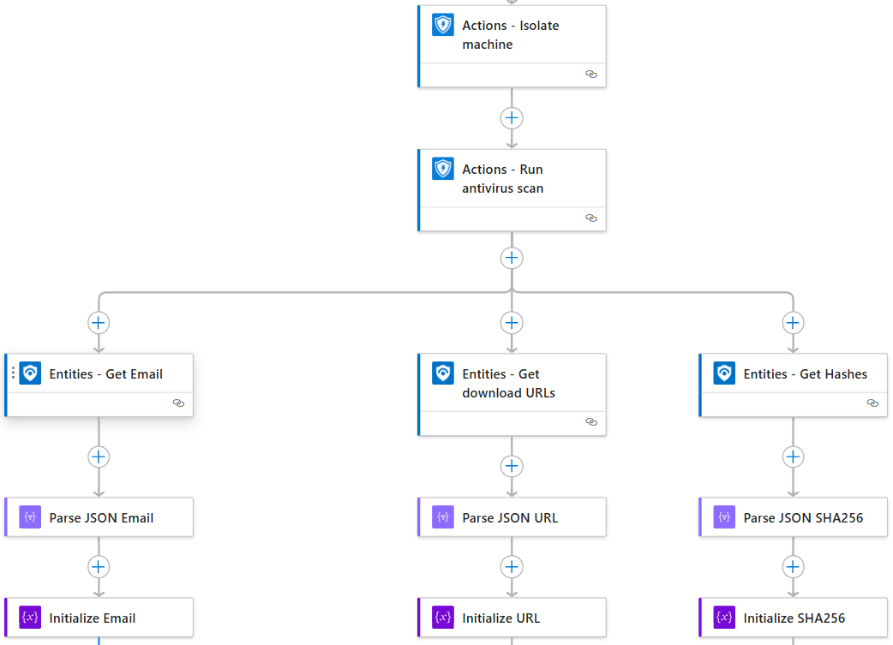
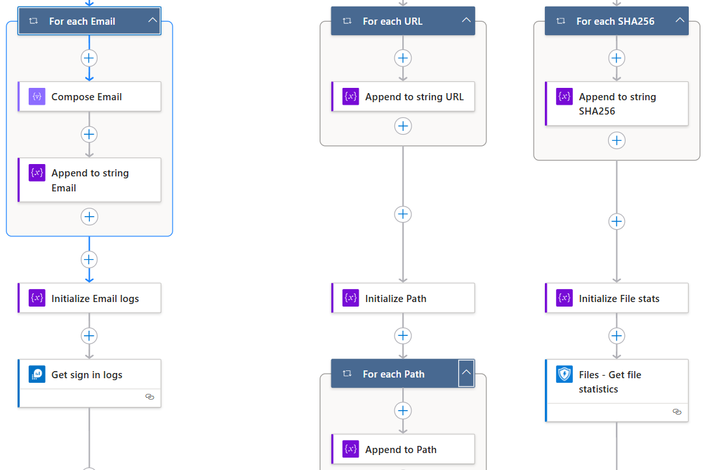
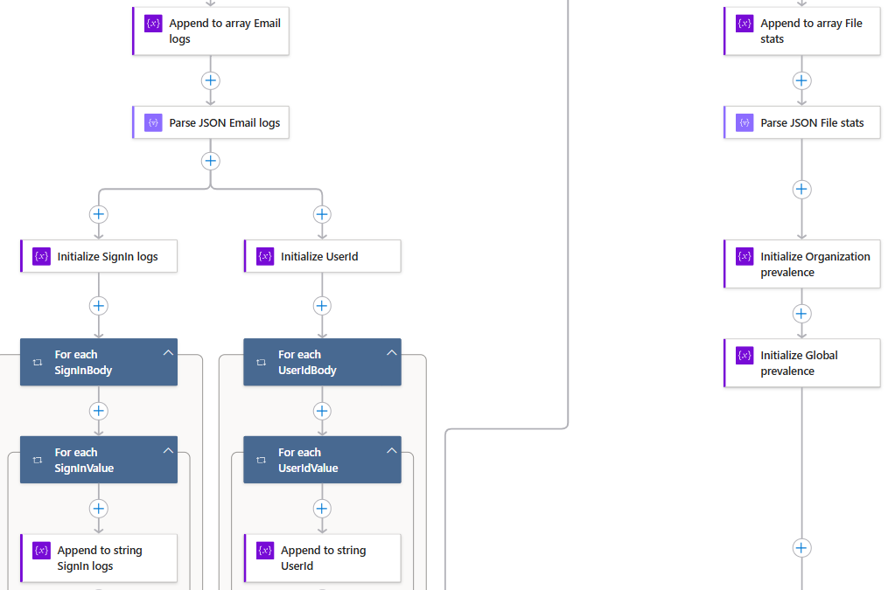
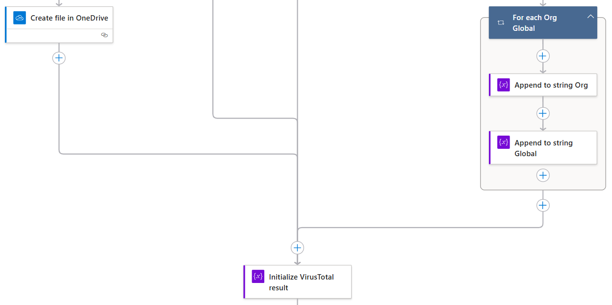
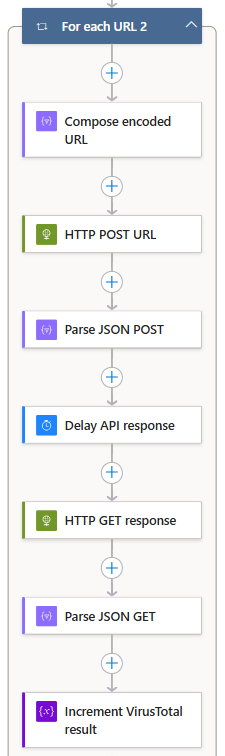
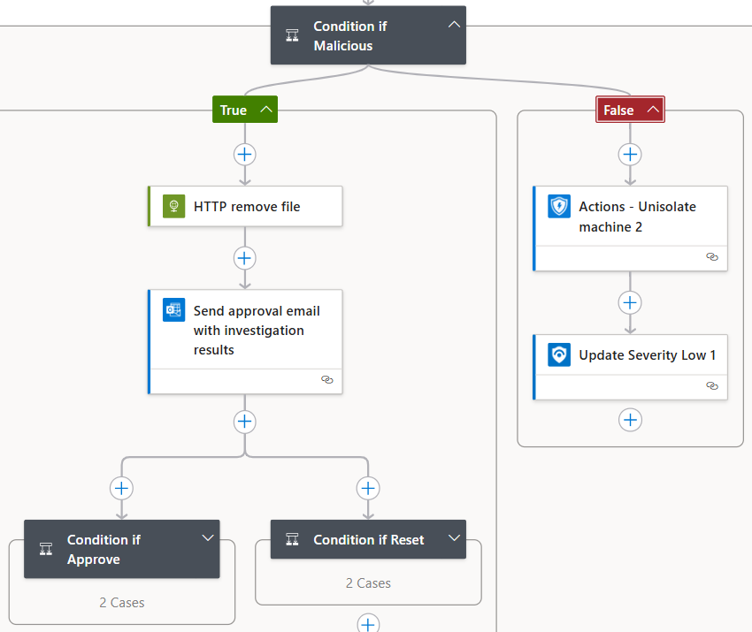

# PowerShell Download Automation Playbook
This repository contains all the code for the PowerShell Download Automation Playbook, an Azure Logic App that automates incident response for suspicious PowerShell download activities detected in Microsoft Sentinel. It triggers on incidents, isolates devices, collects data (DeviceId, email logs, URLs, SHA256 hashes), saves reports to OneDrive, analyzes threats with VirusTotal and Microsoft Defender, and executes remediation like file removal or password resets, with recommendations for forensics and device restoration if compromised.

## Top to bottom Logic App Overview

### Part 1:

  

### Part 2:

  

### Part 3:

  

### Part 4:

  

### Part 5:

  

### Part 6:

  

### Part 7:

  

